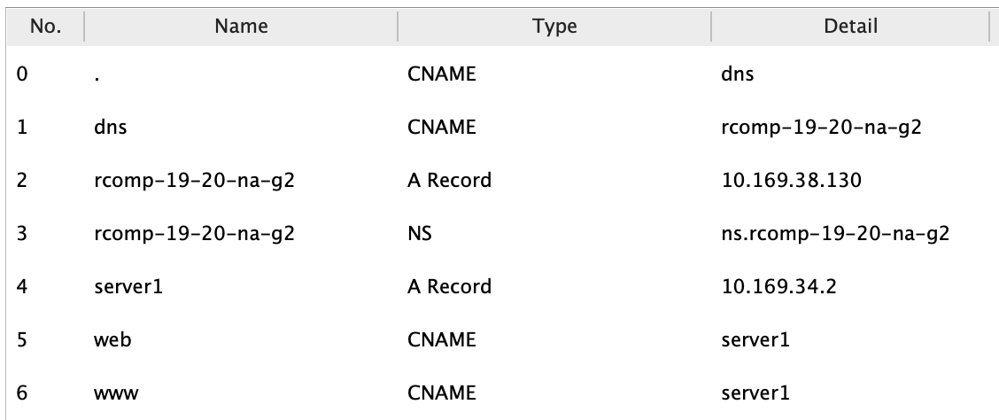
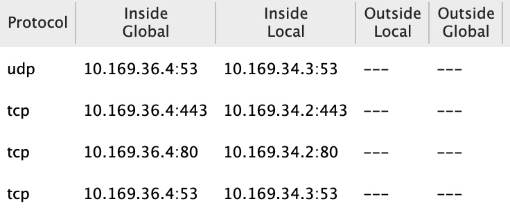

RCOMP 2019-2020 Project - Sprint 3
===========================================
(This folder is to be created/edited by the team member 1181436 only)

### 1. OSPF dynamic routing ###

Static routing will no longer be used, thus on every router, the existing static routing tables should be erased, the only exception is the default route established in the building A router.

**Configs**

    **Backbone**

    no router ospf 1
    router ospf 1
    network 10.169.36.0 0.0.0.127 area 0
    default-information originate
    exit

    **Edificio A**
    no router ospf 1
    router ospf 1
    network 10.169.36.0 0.0.0.127 area 0
    network 10.169.37.64 0.0.0.63 area 1
    network 10.169.37.0 0.0.0.63 area 1
    network 10.169.37.128 0.0.0.31 area 1
    network 10.169.36.128 0.0.0.127 area 1
    network 10.169.37.160 0.0.0.31 area 1
    exit

    **Edificio B**
    no router ospf 1
    router ospf 1
    network 10.169.36.0 0.0.0.127 area 0
    network 10.169.38.64 0.0.0.63 area 2
    network 10.169.39.0 0.0.0.127 area 2
    network 10.169.39.128 0.0.0.127 area 2
    network 10.169.38.128 0.0.0.15 area 2
    network 10.169.38.0 0.0.0.63 area 2
    exit

    **Edificio C**
    no router ospf 1
    router ospf 1
    network 10.169.36.0 0.0.0.127 area 0
    network 10.169.35.128 0.0.0.63 area 3
    network 10.169.35.64 0.0.0.63 area 3
    network 10.169.35.0 0.0.0.63 area 3
    network 10.169.34.0 0.0.0.255 area 3
    network 10.169.35.192 0.0.0.63 area 3
    exit

    **Edificio D**
    no router ospf 1
    router ospf 1
    network 10.169.36.0 0.0.0.127 area 0
    network 10.169.32.192 0.0.0.63 area 4
    network 10.169.32.128 0.0.0.63 area 4
    network 10.169.32.64 0.0.0.63 area 4
    network 10.169.33.0 0.0.0.255 area 4
    network 10.169.32.0 0.0.0.63 area 4
    exit

### 2. HTTP Service ###

Both HTTP and HTTPS were set on server with IP 10.169.34.2.

### 3. DHCPv4 Service ###

The router in each building must provide the DHCPv4service to all local networks(within the building), except  for  DMZ  networks  and  the  backbone  where  IPv4  node  addresses  are  static  and  manually  set (routers and servers).

For  the  VoIP  VLAN,  the  DHCP  server  configuration  has  toinclude option  150,  it represent  the  IP address of the TFTP (Trivial File Transfer Protocol) server to be used by Cisco IP phones model 7960 to download their configuration file.

**Configs**

*Ground Floor Outlets*

    ip dhcp excluded-address 10.169.35.129 10.169.35.133
    ip dhcp pool C_groundOutlets
    default-router 10.169.35.129
    network 10.169.35.128 255.255.255.192
    dns-server 10.169.34.3
    domain-name building-c.rcomp-19-20-na-g2

*Floor One Outlets*

    ip dhcp excluded-address 10.169.35.65 10.169.35.69
    ip dhcp pool C_floorOneOutlets
    default-router 10.169.35.65
    network 10.169.35.64 255.255.255.192
    dns-server 10.169.34.3
    domain-name building-c.rcomp-19-20-na-g2

*Wi-Fi network*

    ip dhcp excluded-address 10.169.35.1 10.169.35.5
    ip dhcp pool C_wifi
    default-router 10.169.35.1
    network 10.169.35.0 255.255.255.192
    dns-server 10.169.34.3
    domain-name building-c.rcomp-19-20-na-g2

### 4. VoIP service ###

Phone numbers in building C will follow the pattern 3***.

**Configs**

  **C_HC0.1** [switch ground floor]

    interface gigabitEthernet 6/1
    switchport mode access
    switchport voice vlan 715
    no switchport access vlan

  **C_HC0.2** [switch ground floor]

    interface gigabitEthernet 5/1
    switchport mode access
    switchport voice vlan 715
    no switchport access vlan

  **Building C** [router]

    ip dhcp excluded-address 10.169.35.193
    ip dhcp pool C_VOIP
    default-router 10.169.35.193
    option 150 ip 10.169.35.193
    network 10.169.35.192 255.255.255.192

    telephony-service
    max-ephones 40
    max-dn 40
    ip source-address 10.169.35.193 port 2000
    auto assign 1 to 40

    ephone-dn 1
    number 3001

    ephone-dn 2
    number 3002

    //Redirect calls to Building A
    dial-peer voice 1 voip
    destination-pattern 1...
    session target ipv4:10.169.36.2

    //Redirect calls to Building B
    dial-peer voice 2 voip
    destination-pattern 2...
    session target ipv4:10.169.36.3

    //Redirect calls to Building D
    dial-peer voice 4 voip
    destination-pattern 4...
    session target ipv4:10.169.36.5

### 5. DNS ###

A DNS service was set on server with IP 10.169.34.3, the table of rules was defined according to the sprint backlog and as explained in the planning.
Every DHCP configuration was updated to include the connection to the DNS server, through the defined IP, and the domain name is according to the planning.

### 6. NAT (Network Address Translation) ###

    interface gigabitEthernet 0/3/0
    ip nat inside
    interface gigabitEthernet 0/3/0.1
    ip nat inside
    interface gigabitEthernet 0/3/0.2
    ip nat inside
    interface gigabitEthernet 0/3/0.3
    ip nat inside
    interface gigabitEthernet 0/3/0.4
    ip nat inside
    interface gigabitEthernet 0/3/0.5
    ip nat inside
    interface gigabitEthernet 0/1/0
    ip nat outside
    no access-list 5
    access-list 5 permit 10.169.34.0 0.0.1.255
    ip nat inside source list 5 interface gigabitEthernet 0/1/0 overload
    ip nat inside source static tcp 10.169.34.2 80 10.169.36.4 80
    ip nat inside source static tcp 10.169.34.2 443 10.169.36.4 443
    ip nat inside source static tcp 10.169.34.3 53 10.169.36.4 53
    ip nat inside source static udp 10.169.34.3 53 10.169.36.4 53

### 7. Static Firewall (ACLs) ###
**External spoofing + router services (GigabitEthernet 0/1/0)**

    ip access-list extended externalSpoofing
    remark Deny Edi C Network
    deny ip 10.169.34.0 0.0.1.255 any
    remark Allow Edi A Network
    permit ip 10.169.36.0 0.0.1.255 any
    remark Allow Edi B Network
    permit ip 10.169.38.0 0.0.1.255 any
    remark Allow Edi D Network
    permit ip 10.169.32.0 0.0.1.255 any
    remark Allow Campus Network
    permit ip 10.169.36.0 0.0.0.127 any
    remark Allow ISP Network
    permit ip 17.10.5.148 0.0.0.3 any
    remark Allow VoIP traffic
    permit udp any any eq tftp
    permit tcp any eq 1720 any
    permit tcp any any eq 1720
    permit tcp any any eq 5060
    permit udp any any eq 5060
    permit tcp any any eq 2000
    permit udp any any eq 2000
    remark Allow OSPF traffic
    permit ospf 10.169.32.0 0.0.15.255 any
    remark Allow NAT traffic
    permit tcp any host 10.169.36.4 eq 80
    permit tcp any host 10.169.36.4 eq 443
    permit tcp any host 10.169.36.4 eq 53
    permit udp any host 10.169.36.4 eq 53
    remark Allow ICMP request/reply
    permit icmp any any echo
    permit icmp any any echo-reply

    interface GigabitEthernet 0/1/0
    ip access-group externalSpoofing in

**DMZ (GigabitEthernet 0/3/0.4)**

    ip access-list extended internalSpoofingDMZ
    remark Allow DMZ network
    permit ip 10.169.34.0 0.0.0.255 any
    remark Deny Ground Outlet network
    deny ip 10.169.35.128 0.0.0.63 any
    remark Deny First Floor network
    deny ip 10.169.35.64 0.0.0.63 any
    remark Deny VoIP network
    deny ip 10.169.35.192 0.0.0.63 any
    remark Deny WiFi network
    deny ip 10.169.35.0 0.0.0.63 any
    remark Allow DHCP traffic
    permit udp any eq bootpc any eq bootps
    remark Allow OSPF traffic
    permit ospf 10.169.34.0 0.0.1.255 any
    remark Allow HTTP/HTTPS traffic
    permit tcp host 10.169.34.2 eq 80 any
    permit tcp host 10.169.34.2 eq 443 any
    remark allow DNS traffic
    permit tcp host 10.169.34.3 eq 53 any
    permit udp host 10.169.34.3 eq 53 any
    remark Allow ICMP request/reply
    permit icmp any any echo
    permit icmp any any echo-reply

    interface GigabitEthernet 0/3/0.4
    ip access-group internalSpoofingDMZ in

    ip access-list extended DMZ
    remark Allow DNS traffic
    permit udp any host 10.169.34.3 eq domain
    remark Allow HTTP
    permit tcp any host 10.169.34.2 eq www
    remark Allow HTTPS
    permit tcp any host 10.169.34.2 eq 443
    remark Allow ICMP request/reply
    permit icmp any any echo
    permit icmp any any echo-reply
    remark Block All Other Traffic
    deny ip any any

    interface GigabitEthernet 0/3/0.4
    ip access-group DMZ out

**Ground Floor Outlets (GigabitEthernet 0/3/0.1)**

    ip access-list extended internalSpoofingGroundOutlets
    remark Deny DMZ network
    deny ip 10.169.34.0 0.0.0.255 any
    remark Permit Ground Outlet network
    permit ip 10.169.35.128 0.0.0.63 any
    remark Deny First Floor network
    deny ip 10.169.35.64 0.0.0.63 any
    remark Deny VoIP network
    deny ip 10.169.35.192 0.0.0.63 any
    remark Deny WiFi network
    deny ip 10.169.35.0 0.0.0.63 any
    remark Allow DHCP traffic
    permit udp any eq bootpc any eq bootps
    remark Allow OSPF traffic
    permit ospf 10.169.34.0 0.0.1.255 any
    remark Allow HTTP/HTTPS traffic
    permit tcp host 10.169.34.2 eq 80 any
    permit tcp host 10.169.34.2 eq 443 any
    remark allow DNS traffic
    permit tcp host 10.169.34.3 eq 53 any
    permit udp host 10.169.34.3 eq 53 any
    remark Allow ICMP request/reply
    permit icmp any any echo
    permit icmp any any echo-reply

    interface GigabitEthernet 0/3/0.1
    ip access-group internalSpoofingGroundOutlets in

**Floor One Outlets (GigabitEthernet 0/3/0.2)**

    ip access-list extended internalSpoofingFloorOne
    remark Deny DMZ network
    deny ip 10.169.34.0 0.0.0.255 any
    remark Deny Ground Outlet network
    deny ip 10.169.35.128 0.0.0.63 any
    remark Permit First Floor network
    permit ip 10.169.35.64 0.0.0.63 any
    remark Deny VoIP network
    deny ip 10.169.35.192 0.0.0.63 any
    remark Deny WiFi network
    deny ip 10.169.35.0 0.0.0.63 any
    remark Allow DHCP traffic
    permit udp any eq bootpc any eq bootps
    remark Allow OSPF traffic
    permit ospf 10.169.34.0 0.0.1.255 any
    remark Allow HTTP/HTTPS traffic
    permit tcp host 10.169.34.2 eq 80 any
    permit tcp host 10.169.34.2 eq 443 any
    remark allow DNS traffic
    permit tcp host 10.169.34.3 eq 53 any
    permit udp host 10.169.34.3 eq 53 any
    remark Allow ICMP request/reply
    permit icmp any any echo
    permit icmp any any echo-reply

    interface GigabitEthernet 0/3/0.2
    ip access-group internalSpoofingFloorOne in

**WiFi (GigabitEthernet 0/3/0.3)**

    ip access-list extended internalSpoofingWiFi
    remark Deny DMZ network
    deny ip 10.169.34.0 0.0.0.255 any
    remark Deny Ground Outlet network
    deny ip 10.169.35.128 0.0.0.63 any
    remark Deny First Floor network
    deny ip 10.169.35.64 0.0.0.63 any
    remark Deny VoIP network
    deny ip 10.169.35.192 0.0.0.63 any
    remark Permit WiFi network
    permit ip 10.169.35.0 0.0.0.63 any
    remark Allow DHCP traffic
    permit udp any eq bootpc any eq bootps
    remark Allow OSPF traffic
    permit ospf 10.169.34.0 0.0.1.255 any
    remark Allow HTTP/HTTPS traffic
    permit tcp host 10.169.34.2 eq 80 any
    permit tcp host 10.169.34.2 eq 443 any
    remark allow DNS traffic
    permit tcp host 10.169.34.3 eq 53 any
    permit udp host 10.169.34.3 eq 53 any
    remark Allow ICMP request/reply
    permit icmp any any echo
    permit icmp any any echo-reply

    interface GigabitEthernet 0/3/0.3
    ip access-group internalSpoofingWiFi in

**VoIP (GigabitEthernet 0/3/0.5)**

    ip access-list extended internalSpoofingVoIP
    remark Deny DMZ network
    deny ip 10.169.34.0 0.0.0.255 any
    remark Deny Ground Outlet network
    deny ip 10.169.35.128 0.0.0.63 any
    remark Deny First Floor network
    deny ip 10.169.35.64 0.0.0.63 any
    remark Permit VoIP network
    permit ip 10.169.35.192 0.0.0.63 any
    remark Deny WiFi network
    deny ip 10.169.35.0 0.0.0.63 any
    remark Allow DHCP traffic
    permit udp any eq bootpc any eq bootps
    remark Allow VoIP traffic
    permit udp 10.169.35.192 0.0.0.63 eq tftp any
    permit tcp 10.169.35.192 0.0.0.63 eq 1720 any
    permit tcp 10.169.35.192 0.0.0.63 eq 1720 any
    permit tcp 10.169.35.192 0.0.0.63 any eq 1720
    permit tcp 10.169.35.192 0.0.0.63 any eq 1720
    permit tcp 10.169.35.192 0.0.0.63 any eq 5060
    permit udp 10.169.35.192 0.0.0.63 any eq 5060
    permit tcp 10.169.35.192 0.0.0.63 any eq 2000
    permit udp 10.169.35.192 0.0.0.63 any eq 2000
    remark Allow OSPF traffic
    permit ospf 10.169.34.0 0.0.1.255 any
    remark Allow ICMP request/reply
    permit icmp any any echo
    permit icmp any any echo-reply

    interface GigabitEthernet 0/3/0.5
    ip access-group internalSpoofingVoIP in
