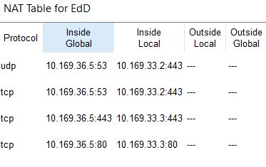

RCOMP 2019-2020 Project - Sprint 3
===========================================
### 1. OSPF dynamic routing ###

Static routing will no longer be used, thus on every router, the existing static routing tables should be erased, the only exception is the default route established in the building A router.

**Configs**

    **Edificio D**
    no router ospf 1
    router ospf 1
    network 10.169.36.0 0.0.0.127 area 0
    network 10.169.32.192 0.0.0.63 area 4
    network 10.169.32.128 0.0.0.63 area 4
    network 10.169.32.64 0.0.0.63 area 4
    network 10.169.33.0 0.0.0.255 area 4
    network 10.169.32.0 0.0.0.63 area 4
    exit

### 2. HTTP Service ###

Both HTTP and HTTPS were set on server with IP 10.169.33.3.

### 3. DHCPv4 Service ###

The router in each building must provide the DHCPv4service to all local networks(within the building), except  for  DMZ  networks  and  the  backbone  where  IPv4  node  addresses  are  static  and  manually  set (routers and servers).

For  the  VoIP  VLAN,  the  DHCP  server  configuration  has  toinclude option  150,  it represent  the  IP address of the TFTP (Trivial File Transfer Protocol) server to be used by Cisco IP phones model 7960 to download their configuration file.

**Configs**

*Ground Floor Outlets*

    ip dhcp excluded-address 10.169.32.193 10.169.32.195
    ip dhcp pool Pool_D_groundOutlets
    network 10.169.32.192 255.255.255.192
    default-router 10.169.32.193
    dns-server 10.169.33.2
    domain-name building-d.rcomp-19-20-na-g2

*Floor One Outlets*

    ip dhcp excluded-address 10.169.32.129 10.169.32.131
    ip dhcp pool Pool_D_floorOneOutlets
    network 10.169.32.128 255.255.255.192
    default-router 10.169.32.129
    dns-server 10.169.33.2
    domain-name building-d.rcomp-19-20-na-g2

*Wi-Fi network*

    ip dhcp excluded-address 10.169.32.65 10.169.32.67
    ip dhcp pool Pool_D_wifi
    network 10.169.32.64 255.255.255.192
    default-router 10.169.32.65
    dns-server 10.169.33.2
    domain-name building-d.rcomp-19-20-na-g2

### 4. VoIP service ###

Phone numbers in building D will follow the pattern 4***.

**Configs**

**C_HC0.2** [switch ground floor]

    interface fa 8/1
    switchport mode access
    switchport voice vlan 720
    no switchport access vlan

  **C_HC1.1** [switch floor one]

    interface gig 4/1
    switchport mode access
    switchport voice vlan 720
    no switchport access vlan

  **Building D** [router]

    ip dhcp excluded-address 10.169.32.1 10.169.32.5
    ip dhcp pool D_VOIP
    default-router 10.169.32.1
    option 150 ip 10.169.32.1
    network 10.169.32.0 255.255.255.192
    
    telephony-service
    max-ephones 2
    max-dn 2
    ip source-address 10.169.32.1 port 2000
    auto assign 1 to 2
    
    ephone-dn 1
    number 4001
    
    ephone-dn 2
    number 4002

    //Redirect calls to Building A
    dial-peer voice 1 voip
    destination-pattern 1...
    session target ipv4:10.169.36.2

    //Redirect calls to Building B
    dial-peer voice 2 voip
    destination-pattern 2...
    session target ipv4:10.169.36.3

    //Redirect calls to Building C
    dial-peer voice 3 voip
    destination-pattern 3...
    session target ipv4:10.169.36.4

### 5. DNS ###

A DNS service was set on server with IP 10.169.33.2, the table of rules was defined according to the sprint backlog and as explained in the planning.
Every DHCP configuration was updated to include the connection to the DNS server, through the defined IP, and the domain name is according to the planning.

### 6. NAT (Network Address Translation) ###

    en
    config t
    interface gig 0/3/0
    ip nat inside
   
    interface gig 0/3/0.1
    ip nat inside
   
    interface gig 0/3/0.2
    ip nat inside
  
    interface gig 0/3/0.3
    ip nat inside

    interface gig 0/3/0.4
    ip nat inside

    interface gig 0/3/0.5
    ip nat inside

    interface gig 0/1/0
    ip nat outside

    interface gig 0/1/0.1
    ip nat outside

    no access-list 5
    access-list 5 permit 10.169.32.0 0.0.1.255
    ip nat inside source list 5 interface gigabitEthernet 0/1/0 overload
    ip nat inside source list 5 interface gigabitEthernet 0/1/0.1 overload
    ip nat inside source static tcp 10.169.33.3 80 10.169.36.5 80
    ip nat inside source static tcp 10.169.33.3 443 10.169.36.5 443
    ip nat inside source static tcp 10.169.33.2 443 10.169.36.5 53
    ip nat inside source static udp 10.169.33.2 443 10.169.36.5 53

### 7. Static Firewall (ACLs) ###
